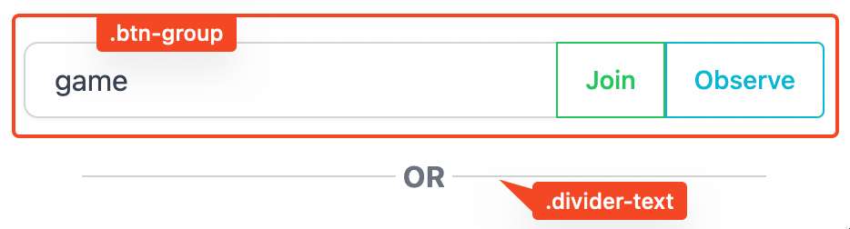

# Intro

This project contains TailwindCSS customizations mainly for my own use. You are free to adopt and adapt to your own situation. 

## 1. Tailwind Custom Animations

The animations are inspired by https://animate.style and others. 
This library provides a integration point for some of the animations with tailwind. 

### Examples 

Check out [animate.style](https://animate.style) for effects of the animations. 

Note: Not all [animate.style](https://animate.style) animations are included. This project only contains animations I personally use plus some others not on [animate.style](https://animate.style). 

### How To Use

In `tailwind.config.js` do: 
```js
module.exports = {
  ...
  theme: {
    ...
    extend: {
      ...
      ...require('./_tailwindcss/_tw-animations'), // Update path to fit your setup
    }
  }
}
```

Then on any element that you wish to animate, give it a class e.g. `animate-tada`.

## 2. Tailwind Plugin

The plugin adds the following Components to tailwind: 

- btn
- btn-outline
- btn-group
- btn-[color name]
- btn-outline-[color name]
- divider-text

### Examples 

```html
<button class="btn btn-indigo">Submit</button>
```


```html
<button class="btn btn-outline-indigo">Home</button>
```


```html
<div class="flex btn-group">
  <input type="text" class="grow" placeholder="Search or Create A Room" value="game" />
  <button class="btn btn-outline-green grow-0">Join</button>
  <button class="btn btn-outline-cyan grow-0">Observe</button>
</div>
```
```html
<div class="divider-text mx-8">
  <span class="bg-white p-1 font-bold text-gray-500">OR</span>
</div>
```


### How To Use 

Add to `tailwind.config.js`: 
```js
module.exports = {
  ...
  plugins: [
    ...,
    require('./_tailwindcss/_tw-components'), // Update path to fit your setup
  ]
}
```
